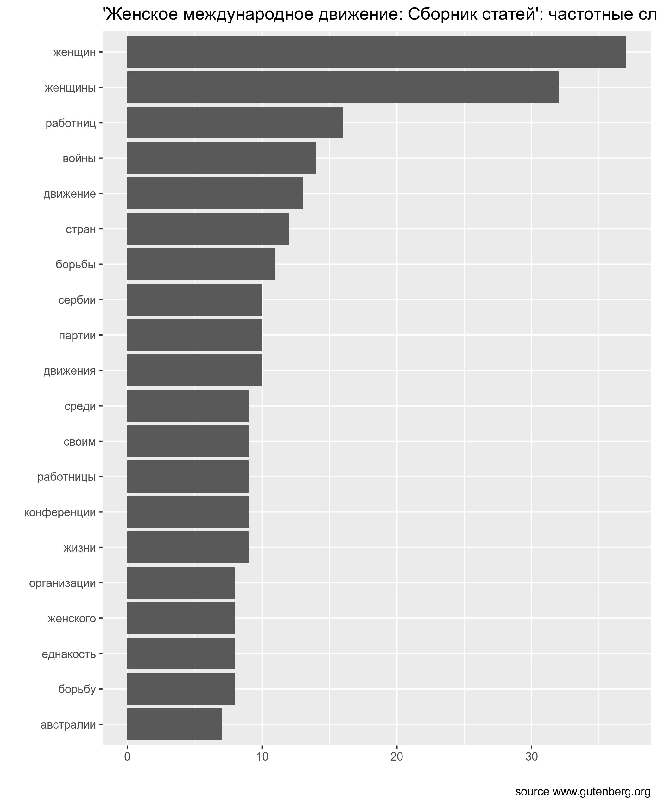

# HW


```{block, type = "rmdtask"}
[Вот отсюда](https://raw.githubusercontent.com/agricolamz/DS_for_DH/master/data/zabolockiy_merknut_znaki_zodiaka.txt) можно скачать файл с текстом стихотворения Н. Заболоцкого "Меркнут знаки задиака". Посчитайте долю женских (ударение падает на **предпоследний** слог рифмующихся слов) и мужских (ударение падает на **последний** слог рифмующихся слов) рифм в стихотворении.
```


<details> <summary> 📋 список подсказок ➡ </summary> 

<details> <summary> 👁 Датасеты скачивается с ошибкой, почему? ➡ </summary>
Дело в том, что исходный файл в формате `.txt`, а не `.csv`. Его нужно скачивать, например, командой `read_lines()` <br>
</details>

<details> <summary> 👁 Ошибка: `...applied to an object of class "character"` ➡ </summary>  
Скачав файл Вы получили вектор со строками, где каждая элимент вектора -- строка стихотворения. Создайте `tibble()`, тогда можно будет применять стандартные инструменты `tidyverse`.
<br>
</details>

<details> <summary> 👁 Хорошо, `tibble()` создан, что дальше? ➡ </summary>
Дальше нужно создать переменную, из которой будет понятно, мужская в каждой строке рифма, или женская.
<br>
</details>

<details> <summary> 👁 А как определить, какая рифма? Нужно с словарем сравнивать? ➡ </summary>
Формально говоря, определять рифму можно по косвенным признакам. Все стихотворение написано четырехстопным хореем, значит в нем либо 7, либо 8 слогов. Значит, посчитав количество слогов, мы поймем, какая перед нами рифма.
<br>
</details>

<details> <summary> 👁 А как посчитать гласные?  ➡ </summary>
Нужно написать регулярное выражение... вроде бы это тема нашего занятия...
<br>
</details>

<details> <summary> 👁 Гласные посчитаны. А что дальше?   ➡ </summary>
Ну теперь нужно посчитать, сколько каких длин (в количестве слогов) бывает в стихотворении. Это можно сделать при помощи функции `count()`.
<br>
</details>

<details> <summary> 👁 А почему у меня есть строки длины 0 слогов   ➡ </summary>
Ну, видимо, в стихотворении были пустые строки. Они использовались для разделения строф.
<br>
</details>

<details> <summary> 👁 А почему у меня есть строки длины 6 слогов  ➡ </summary>
Ну, видимо, Вы написали регулярное выражение, которое не учитывает, что гласные буквы могут быть еще и в начале строки, а значит написаны с большой буквы.
<br>
</details>
</details>


```{block, type = "rmdtask"}
В ходе анализа данных чаще всего бороться со строками и регулярными выражениями приходится в процессе обработки неаккуратнособранных анкет. Предлагаю обработать переменные `sex` и `age` [такой вот неудачно собранной анкеты](https://raw.githubusercontent.com/agricolamz/DS_for_DH/master/data/mad_questionary.csv) и построить следующий график:
```


```{r cache=TRUE, include=FALSE}
read_csv("https://raw.githubusercontent.com/agricolamz/DS_for_DH/master/data/mad_questionary.csv") %>% 
  mutate(sex = str_replace_all(sex, "^[Жж].*", "женский"),
         sex = str_replace_all(sex, "^[Мм].*", "мужской"),
         age = str_remove_all(age, " лет"),
         age = as.integer(age)) %>%
  ggplot(aes(age, fill = sex))+
  geom_dotplot(method = "histodot")+
  scale_y_continuous(NULL, breaks = NULL) # чтобы убрать ось y
```

<details> <summary> 📋 список подсказок ➡ </summary> 

<details> <summary> 👁 А что это за `geom_...()`? ➡ </summary>
Это [`geom_dotplot()`](https://agricolamz.github.io/DS_for_DH/viz-1.html#%D0%B4%D0%BE%D1%82%D0%BF%D0%BB%D0%BE%D1%82) с аргументом `method = "histodot"` и с удаленной осью y при помощи команды `scale_y_continuous(NULL, breaks = NULL)` 
<br>
</details>

<details> <summary> 👁 Почему на графике рисутеся каждое значение возраста? ➡ </summary>
Если Вы все правильно преобразовали, должно помочь преобразование строковой переменной age в числовую при помощи функции as.integer(). 
<br>
</details>
</details>

```{block, type = "rmdtask"}
Скачайте из проекта gutenberg.org текст "Женское международное движение: Сборник статей". Используя список русских стопслов (папка `data`, файл `stopwords_ru.csv`), уберите из текста служебные слова, посчитайте и визуализируйте 20 самых частостных слов текста.
```



```{block, type = "rmdtask"}
* Скачайте из проекта <gutenberg.org> текст "Красавице, которая нюхала табак",
* используйте команду `str_c(text_5316$text, collapse = " ")`, чтобы объединить все строки, на которые поделено произведение в одну строку, 
* запустите на получившемся векторе анализатор `russian-syntagrus-ud-2.4-190531.udpipe`, 
* в получившемся датафрейме замените все пометы `DET` в столбце с частями речи (переменная `upos`) на `PART`, а у двух слов с пометой `AUX` поменяйте помету на `PART` (слово *б*) и на `VERB` (слово *быть*),
* посчитайте каждой из частей речи (переменная `upos`), 
* и постройте график:
```


